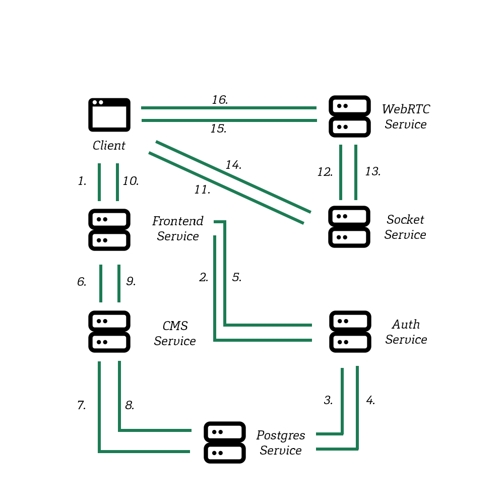
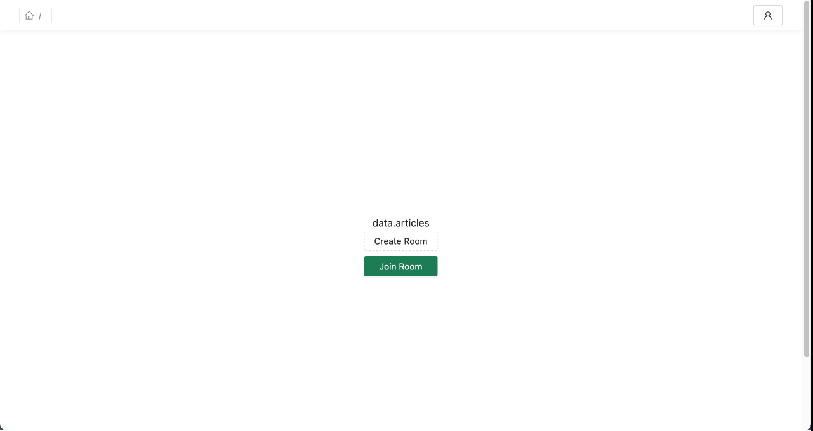
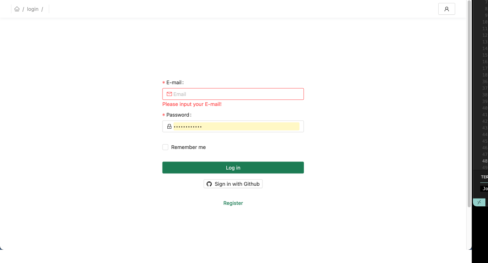
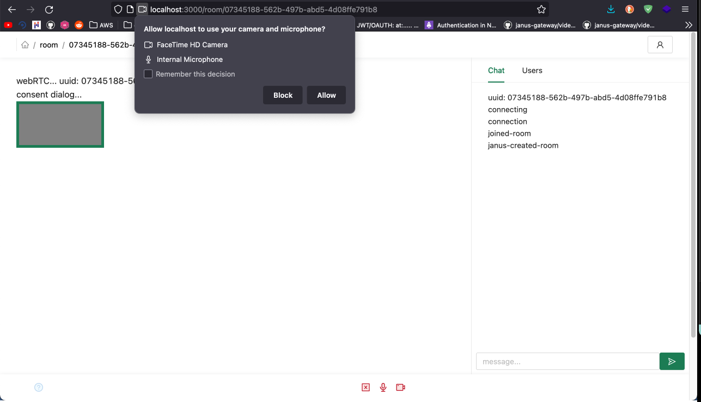
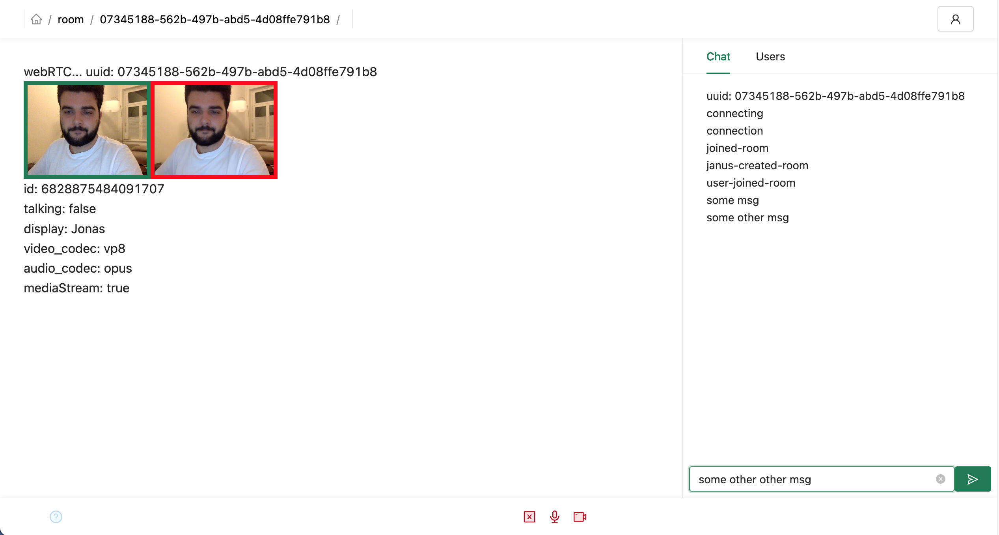

# Description
> Development of a web application about literature with focus on chat and language functionality

This work is about the documentation and theoretical classification of a <mark>prototype</mark> for a web app using Technologies like Next.js, Strapi, Postgresql, Express, Websockets, WebRTC, Janus SFU Unit and Docker. The application is intended to enable users to interactively and digitally exchange information about literature in Discussion Room's like Google Hangout.

## Status
- [ ] _in progress_
- [x] _finished_
- [ ] _no longer continued_ 

*this application is finished, as it was part on my bachelor thesis and is supposed to be a prototype!*

## Table of contents
  - [Description](#description)
  - [Status](#status)
  - [Table of contents](#table-of-contents)
  - [General info](#general-info)
  - [Screenshots](#screenshots)
  - [Technologies](#technologies)
  - [Setup](#setup)
  - [Known Issues](#known-issues)
  - [Thesis](#thesis)
## General info
The platform is developed on the basis of a microservices architecture. Each Service is a dockerized applikation that communicates with the other services and can be deployed independently.


________
Frontend Service =  Next.js <br/>
CMS Service = Strapi <br/>
Postgres Service = Postgresql <br/>
Auth Service = Express.js <br/>
Socket Service = Websocket Server <br />
WebRTC Service = Janus WebRTC - SFU Unit <br />
________
</br></br></br>

## Screenshots

| Homepage | <br/><br/>



| Login Screen | <br/><br/>


| Join Room | <br/><br/>


| Room | <br/><br/>

## Technologies
Main Technologies used in the project: 
* Frontend Service =  Next.js
  - Apollo Client for consuming Strapi's Graphql API
  - AntDesign Component System  
  - Styled Components
  - NProgress Bar
  - Jason Web Tokens Authentication
  - Janus.js Client to communicate with Janus WebRTC Service
* CMS Service = Strapi 
  - Using Graphql API Plugin
* Postgres Service = Postgresql
  - Two Databases (strapi & backend), one for the cms and one for the auth service 
* Auth Service = Express.js
  - Passport
  - Jason Web Tokens
  - Bcrypt
  - Sequelize
* Socket Service = Websocket Server
  - Websocket Server
* WebRTC Service = Janus WebRTC - SFU Unit
  - VideoRoom Plugin

## Setup
[Env] Environment Setup:
- configure the following .env variables:
  (Docker compose) ./.env
  (frontend) ./frontend/.env
  (backend) ./backend/.env
To display the default values run:
```bash
  yarn env:show
```

[Docker-compose] To run this project using docker compose
```bash
$ yarn up       # build containers
$ yarn start    # start containers 
$ yarn stop     # stop containers
```

then go to localhost:1337/admin and create a strapi admin account.
Then go to settings->roles(Users & Permissions plugin)->check count, find, findone and save.


[Local] To run this project, install it locally using yarn:
- requirements: setup postgres database at localhost:5432 -> see defaults at /cms/config/database.js
- install dependencies in /frontend & /cms & /socketService & /authService (yarn)
```bash
$ cd authService && yarn build && yarn dev
$ cd cms && yarn develop
$ cd socketService && yarn build && yarn dev
$ cd webRTCService && bash helper.sh setup && bash helper.sh build && bash helper.sh start 
$ cd frontend && yarn start
```

[Docker] When you have an existing strapi database to restore to your new container:
```bash
$ sh helper.sh db-applybackup --container-name project_cold_way_postgres --file '/Users/Jonas/Desktop/dump-project_cold_way-202104181900.sql' --postgres-db-name project_cold_way --postgres-user postgres
```

## Known Issues
(Setup) When you have already setup a postgresql container for another project, the postgresql container skips creating the database of /postgres/1-schema.sql, because the local postgresql volume already contains a existing database. You can run the script manually and create the database by using the helper.sh script:
```bash
$ sh helper.sh db-applysql --container-name project_cold_way_postgres --schema 1-schema.sql --postgres-user postgres
```

## Thesis
read the thesis at <a href="./readme/Bachelorarbeit_Jonas-Leonhard_611179.pdf">Thesis.pdf</a>